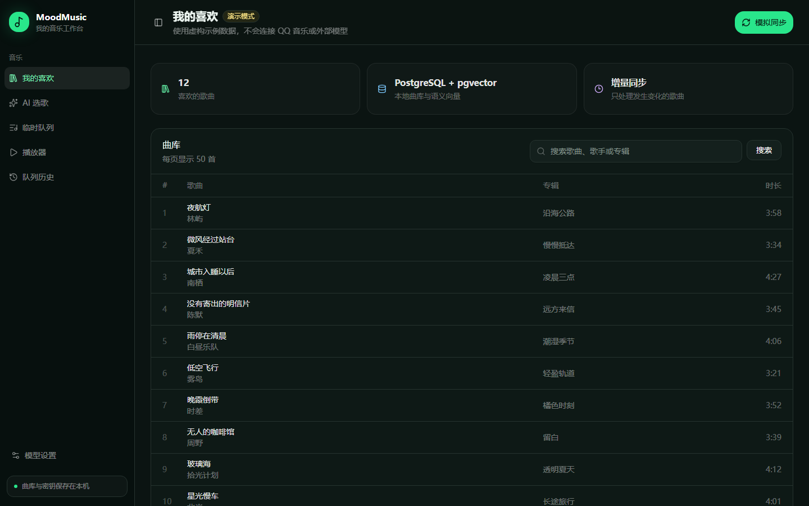

# MoodMusic · AI playlist builder for your own library

[](LICENSE)
[](https://github.com/Chandler-h-blake/mood-music/actions/workflows/ci.yml)
[](services/api/pyproject.toml)
[](apps/web/package.json)
[](docs/development/DEVELOPMENT_GUIDE.md)


Describe a feeling such as “driving alone after midnight, a little lonely but not too sad.” MoodMusic evaluates your complete QQ Music liked library and creates an editable, playable temporary queue—without downloading or proxying audio.

[中文说明](README.md)

## Try it without configuring the full project

The interactive demo uses fictional bundled tracks. It needs no QQ Music account, model key, Python, Docker, or external model request.

On Windows 10 or 11:

1. Install [Node.js LTS](https://nodejs.org/en/download) if it is not already installed.
2. Download and extract the repository ZIP.
3. Double-click **`Start-MoodMusic-Demo.cmd`**. The first run downloads the demo components and then opens your browser automatically.

Double-click **`Stop-MoodMusic.cmd`** when finished. Later launches reuse the installed components.

PowerShell users can run `.\scripts\start-demo.ps1` instead.

## Interface preview



## What it does

- Read-only synchronization of the current user's QQ Music liked library.
- Multi-angle song profiling with traceable sources and explicit unknown values.
- Natural-language intent parsing plus BGE-M3 semantic retrieval.
- Balanced full-library evaluation with no arbitrary Top-K cutoff.
- Match, emotion-curve, random, similarity, manual, refinement, and history-restored queues.
- A local Windows connector that asks the QQ Music desktop client to play each selected track.
- Versioned temporary queues and restorable history.
- Windows-protected local storage for QQ Music cookies and model credentials.

## Architecture

| Layer | Technology |
| --- | --- |
| Web | Next.js, React, TypeScript |
| API | Python, FastAPI, Pydantic |
| Data | PostgreSQL, pgvector, SQLAlchemy, Alembic |
| AI | Configurable chat provider and BGE-M3 embeddings |
| Playback | Local Windows connector; QQ Music remains the audio player |

MoodMusic never asks for a QQ password, modifies the QQ Music installation, retrieves protected audio URLs, or bypasses membership, region, copyright, or DRM restrictions.

## Run the complete local stack

Requirements: Windows, PowerShell 7+, Python 3.12 or 3.13, Node.js 22.13+, Docker Desktop, and the QQ Music desktop client for real playback.

```powershell
.\scripts\setup.ps1
.\scripts\doctor.ps1
.\scripts\start.ps1
```

Then open:

- Web app: `http://127.0.0.1:5173`
- API documentation: `http://127.0.0.1:8000/docs`

Use the local settings page to provide credentials. Never paste a real cookie or API key into source code, `.env`, terminals, issues, commits, or chat messages.

## Development

```powershell
.\scripts\test.ps1
```

The command runs Ruff, pytest, ESLint, TypeScript checking, a production web build, and a production-dependency audit. See [CONTRIBUTING.md](CONTRIBUTING.md), the [documentation index](docs/INDEX.md), and the [security policy](SECURITY.md) before contributing.

## License and platform notice

MoodMusic is available under the [MIT License](LICENSE). It is an independent project and is not affiliated with, endorsed by, or sponsored by Tencent or QQ Music. Users remain responsible for complying with applicable platform terms, content licenses, privacy requirements, and law.
