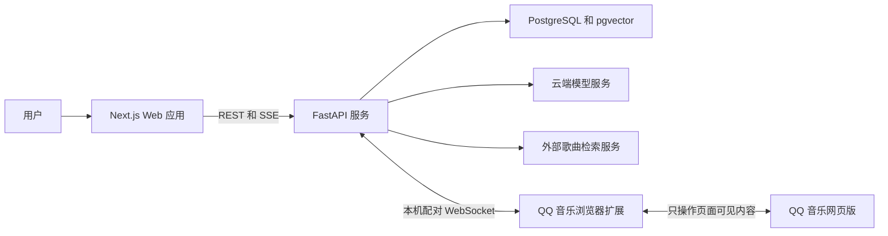

# MoodMusic AI 选歌器

MoodMusic 是一个面向个人音乐库的自然语言选歌产品。用户不需要逐个勾选语言、流派或年代，只需描述当下想听的感觉，例如“凌晨开车时有一点孤独，但不要太悲伤”，系统就会从用户自己的 QQ 音乐“喜欢”列表中找出全部符合条件的歌曲，生成可预览、可调整、可播放的临时队列。

本仓库采用“独立 Web 应用 + QQ 音乐网页版连接器”的产品形态。MoodMusic 负责歌曲建档、AI 理解、语义匹配、候选队列和历史记录；QQ 音乐网页版负责账号授权范围内的歌曲呈现与最终播放。项目不修改 QQ 音乐安装文件，不下载或转发受保护音频，也不绕过会员、地区、版权或 DRM 限制。

> 当前状态：项目骨架与基线文档已建立，尚未开始功能代码开发。MoodMusic 是暂定产品名，可以通过架构决策记录统一更名。

## 产品要解决的问题

用户的“喜欢”歌单可能包含一千多首长期积累的歌曲。传统标签筛选擅长回答“粤语歌”或“乡村音乐”，却很难表达复合、模糊甚至带排除条件的感受。MoodMusic 重点解决以下任务：

- 用自然语言表达完整听歌意图，而不是要求用户操作复杂筛选器。
- 只从用户的“喜欢”列表中形成主候选队列，重新发现已经收藏但被数量淹没的歌曲。
- 为每首歌建立来源可追溯、允许未知值、可以增量更新的多维画像。
- 将全部达到“均衡匹配”标准的歌曲放入候选队列，不做固定 Top-K 截断；没有合适歌曲时明确显示 0 首。
- 支持匹配度、情绪曲线和随机三种排序方式。
- 预览后把确认队列交给 QQ 音乐网页版播放，并在最后一首结束后停止。
- 将网络发现的相似歌曲独立展示，绝不自动混入“喜欢”候选队列。

## 目标用户与使用场景

首个版本只服务于单个 Windows 用户和当前登录的 QQ 音乐账号，不设计多租户、社交或商业化能力。

典型流程：

1. 用户安装本项目的浏览器扩展，并在 QQ 音乐网页版保持正常登录。
2. 扩展读取页面中用户可见的“喜欢”歌曲身份信息；也可以使用手动文件导入作为回退。
3. 后端为新增或变化的歌曲建立多维画像，并显示进度、失败原因和可恢复状态。
4. 用户输入自然语言感觉，系统理解核心意图、强弱、排除项、场景和排序趋势。
5. 系统全量评估已完成画像的“喜欢”歌曲，返回全部通过均衡阈值或边界复核的结果。
6. 用户可以预览、删除、拖动排序、继续追加要求，或选择三种排序模式。
7. 用户确认后，连接器将队列交给 QQ 音乐网页版播放；播放结束后停止。
8. 用户可单独点击“更多风格类似的歌”，查看经过真实检索和身份校验的外部建议。

## 已确认的产品规则

| 规则 | 产品约定 |
| --- | --- |
| 主筛选范围 | AI 主结果永远只来自当前“喜欢”列表 |
| 匹配尺度 | 默认使用均衡匹配，整体感觉优先 |
| 结果数量 | 返回全部通过标准的歌曲，不设置固定数量上限 |
| 空结果 | 合法显示 0 首，不偷偷放宽条件或塞入“最接近”歌曲 |
| 外部推荐 | 独立区域展示，必须经过歌曲身份校验，不自动加入主队列 |
| 反馈 | 删除、跳过、拖动和追加要求仅影响当前搜索会话，不自动形成长期偏好 |
| 长期修正 | 只有用户明确编辑并锁定歌曲画像时才长期保存 |
| 排序 | 匹配度、情绪曲线、随机 |
| 播放结束 | 最后一首结束后停止，不自动续播平台推荐 |
| 展示 | 主结果不展示冗长的 AI 选歌解释 |

## 技术方案

| 模块 | 技术 | 职责 |
| --- | --- | --- |
| Web 应用 | Next.js、React、TypeScript | 搜索、任务进度、候选预览、画像与设置页面 |
| API 服务 | Python、FastAPI、Pydantic | 业务规则、模型适配、任务编排与对外 API |
| 数据访问 | SQLAlchemy、Alembic | 数据模型、事务和迁移 |
| 数据库 | PostgreSQL、pgvector | 歌曲、画像、历史与语义向量 |
| AI | 可配置聊天模型与 Embedding 模型 | 结构化建档、意图理解、向量检索与边界复核 |
| QQ 音乐连接器 | TypeScript、Chrome Extension Manifest V3 | 同步页面可见数据、接收队列、驱动网页播放器 |
| 后台任务 | 首期数据库任务表；达到触发条件后引入 Redis 与 Celery | 初始化、增量画像、重试和断点恢复 |
| 测试 | pytest、Vitest、Playwright | 单元、集成、合约和端到端测试 |
| 交付 | Docker Compose、GitHub Actions | 本地依赖、持续集成和可重复构建 |

本项目不会一开始引入 MongoDB、NestJS、LangChain、LangGraph、MCP、Kubernetes 或微服务。新增基础设施必须通过架构决策记录说明收益、成本和退出方案。

## 系统边界



QQ 登录凭据和 Cookie 留在 QQ 音乐所在的浏览器上下文，不进入 MoodMusic 数据库或模型请求。模型 API Key 只由本机后端通过操作系统凭据存储读取，前端只显示掩码状态。

## 仓库结构

```text
mood-music/
├─ apps/web/                         # Next.js Web 应用
├─ services/api/                     # FastAPI 服务
├─ extensions/qqmusic-web-connector/ # QQ 音乐网页版连接器
├─ packages/contracts/               # 跨模块契约与生成类型
├─ infra/docker/                     # 本地基础设施配置
├─ scripts/                          # 可重复执行的开发脚本
├─ tests/e2e/                        # 跨应用端到端测试
├─ docs/                             # 产品、架构、数据和质量基线
├─ .env.example                      # 环境变量名称示例，不包含密钥
└─ README.md                         # 产品入口与项目总览
```

完整文档索引见 [docs/INDEX.md](docs/INDEX.md)。发生冲突时，已接受的 ADR 优先于系统设计，系统设计优先于 PRD，PRD 优先于 README；代码不得在没有更新对应文档的情况下改变核心产品边界。

## 版本目标

首个可交付版本必须覆盖完整业务闭环，而不是只做界面演示：

- “喜欢”导入、去重、增量同步和失败恢复。
- 多维画像、字段来源与置信度、人工锁定和模型版本追踪。
- 自然语言查询、全量候选、均衡阈值、边界复核和合法 0 结果。
- 三种排序、会话内追加要求、删除与拖动调整。
- QQ 音乐网页版配对、队列播放、状态同步和结束后停止。
- 独立外部推荐、真实歌曲校验和明确的来源标记。
- 搜索历史、临时队列历史和明确触发的正式歌单保存。
- API Key 脱敏、日志脱敏、权限最小化、恢复与卸载说明。
- 自动化测试、人工听感评测和可重复构建。

阶段计划与验收门槛见 [docs/roadmap/ROADMAP.md](docs/roadmap/ROADMAP.md)。

## 开发约定

- 产品文档和用户界面使用中文；代码标识符、接口字段和提交类型使用英文。
- `main` 必须始终可运行；功能通过短生命周期分支开发。
- 功能变更必须同时更新测试和文档，数据库变化必须使用 Alembic 迁移。
- 不提交 `.env`、Cookie、Token、API Key、真实账号数据、版权音频或抓取到的播放地址。
- 不直接依赖未经支持的 QQ 音乐私有接口；连接器优先读取和操作用户可见的网页内容。
- 模型不得捏造未知的 BPM、语言、风格或版本；未知值保持为空并记录原因。

具体规范见 [docs/development/DEVELOPMENT_GUIDE.md](docs/development/DEVELOPMENT_GUIDE.md) 和 [docs/development/CODING_STANDARDS.md](docs/development/CODING_STANDARDS.md)。

## 运行说明

当前仓库只有文档和目录基线，尚无可运行代码，因此暂不提供伪造的安装命令。进入工程实现阶段后，将由各模块的实际清单生成并验证以下统一命令：

```text
make setup    安装并校验开发依赖
make dev      启动 Web、API 和本地基础设施
make test     执行全部自动化测试
make lint     执行格式和静态检查
```

Windows 不具备 `make` 时，将提供功能完全等价的 PowerShell 脚本。

## 分发边界

当前项目定位为个人自用研究项目，不包含 QQ 音乐二进制、商标资源或音频，不代表腾讯或 QQ 音乐官方产品。对外发布、多人使用或商业化之前，必须重新审查平台条款、内容授权、隐私说明和所用依赖许可证。仓库目前不附带开源许可证，默认不授予再分发权利。
