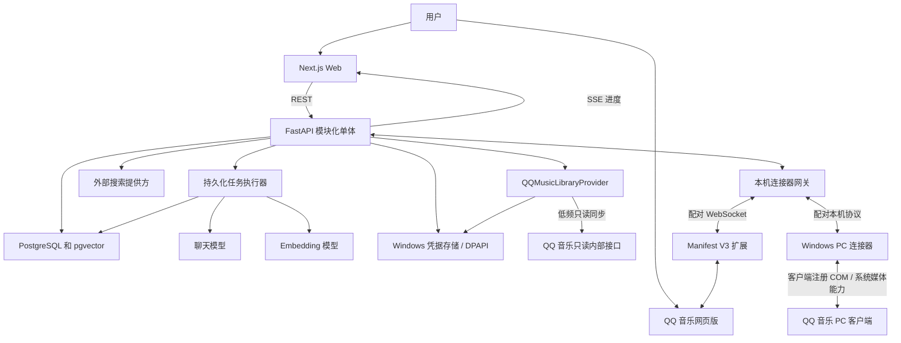

# MoodMusic 系统设计

## 1 架构结论

MoodMusic 采用模块化单体、QQ 音乐数据适配器与可替换播放连接器组合。Next.js Web、FastAPI API、后台任务和 PostgreSQL 构成可独立运行的核心系统；数据适配器隔离 QQ 音乐只读内部接口，Windows PC 助手与备用 Chrome 扩展通过同一版本化本机协议接入，第三方细节不得渗透到搜索、画像或播放列表领域。当前实际播放开发以 PC COM 路线为主。

首期保持单机、单用户和本地优先。模型请求仍调用用户选择的云端提供方，但 QQ 音乐 Cookie、歌曲成员关系、历史、画像和密钥控制留在本机。Cookie 和模型 API Key 进入操作系统凭据存储，不进入业务数据库或模型请求。系统规模以一千至数千首歌曲为主，优先选择正确性、可恢复性和可审计性。

## 2 上下文与数据流



主要数据流：

1. 用户在设置页把已登录的 QQ 音乐 Cookie 提交给只监听环回地址的 API；凭据代理将其写入 Windows 安全存储并验证状态。
2. `QQMusicLibraryProvider` 使用该凭据分页读取“我喜欢”，规范化身份并持久化喜欢成员关系，再创建增量画像任务。
3. 任务执行器调用模型生成经过 schema 校验的字段和向量。
4. 搜索请求写入会话，API 计算全量得分并对边界候选调用模型复核。
5. 用户确认队列并选择连接器后，API 再次检查喜欢成员关系，把版本化命令发送给对应适配器。
6. Chrome 扩展驱动网页播放器，或 PC 助手在能力允许时操作桌面客户端，并回传状态；核心业务不读取 Cookie，数据适配器与连接器都不接触音频流。

## 3 逻辑模块

### 3.1 Web 应用

页面边界：

- `/library`：喜欢曲库、同步状态、待确认歌曲和画像覆盖率。
- `/discover`：自然语言输入、候选预览、会话追加要求和三种排序。
- `/history`：搜索会话、生成队列和清单导出状态。
- `/profiles/[songId]`：画像值、来源、置信度、人工修改和锁定。
- `/settings`：模型提供方、预算、QQ 音乐 Cookie 设置与验证、播放连接器状态和隐私说明。

Web 不直接调用模型、访问数据库或持有服务端密钥。业务状态来自 API；长任务使用 SSE 接收状态，播放状态可以通过 API 的 SSE 或短周期查询更新。

### 3.2 API 模块化单体

建议模块：

- `library`：Song、喜欢成员、导入批次和身份规范化。
- `profiles`：画像 schema、证据、覆盖率、人工锁定和版本。
- `jobs`：任务生命周期、租约、checkpoint、重试与取消。
- `semantic_search`：意图、向量、评分、阈值和边界复核。
- `playlists`：候选、排序、历史、保存和队列快照。
- `external_discovery`：联网搜索、身份校验和外部标记。
- `connectors`：播放扩展配对、能力协商、命令和状态。
- `providers`：QQ 音乐只读同步、聊天、Embedding、联网搜索和凭据引用。

模块之间通过显式服务接口和领域对象协作，不允许从路由层直接拼接 SQL 或调用第三方 SDK。

### 3.3 后台任务

首期使用 PostgreSQL 任务表、行级租约和独立 worker 进程，避免在 FastAPI 请求进程内执行长批次。每个任务保存：类型、输入哈希、状态、进度、checkpoint、尝试次数、下次重试时间、错误类别和租约到期时间。

只有出现多主机、吞吐或运维证据时，才通过 ADR 引入 Redis 与 Celery。迁移时必须保持现有任务语义和 API 不变。

### 3.4 QQ 音乐数据适配器

`QQMusicLibraryProvider` 是数据反腐层：它负责登录状态验证、必要公共参数、分页、响应校验、错误分类和字段映射。核心服务只认识 `ExternalSongRef`、`LikedMembership` 和导入批次，不认识 QQ 音乐的 URL、模块名、Cookie 字段或原始响应。

凭据代理按需从 Windows 安全存储短时取得 Cookie；不得把明文返回给路由、worker 任务载荷或数据库模型。首版只读能力 allowlist 为登录状态和“我喜欢”同步，接口失效时保留最近一次成功曲库并允许 CSV 导入。

### 3.5 QQ 音乐播放连接器

连接器是播放反腐层：QQ 网页上的 DOM 或 PC 客户端注册的 COM 自动化对象与系统媒体状态被翻译成稳定的内部契约。核心服务只认识 `ExternalSongRef`、`ConnectorCapability`、`PlaybackCommand` 和 `PlaybackEvent`，不认识 CSS selector、窗口句柄、COM 成员或控件定位器。连接器不承担音乐库同步，也不导出浏览器 Cookie、客户端登录态或播放地址。依据 ADR 005，PC COM 助手是当前主路线，Chrome 扩展暂停并保留为备用。

## 4 搜索与匹配算法

### 4.1 画像准备

每首歌曲先生成规范化描述：身份、语言、曲风、连续情绪、场景、歌词语义、编曲与可靠声学特征。每个字段同时保存来源和置信度，缺少证据的声学值保持未知。

### 4.2 查询理解

聊天模型输出经过 Pydantic/JSON Schema 验证的 `SearchIntent`：

- 核心语义描述。
- 包含与排除约束。
- 各维度期望范围与重要度。
- 场景与运动适配条件。
- 情绪曲线起点、终点和变化趋势。

原始用户文本始终保留。结构化意图仅是内部计算表示，不能取代原文。

### 4.3 全量评分

对于搜索时刻属于“喜欢”且画像状态可用的每首歌，计算：

- 语义向量相似度。
- 连续情绪、能量、律动和可靠 BPM 的距离。
- 语言、场景、版本等明确边界。
- 字段置信度和缺失惩罚。

综合分数的版本与参数写入搜索会话。库规模在个人范围时先执行全量精确评分；不得因为使用向量索引而只返回固定 Top-K。

### 4.4 阈值与复核

- 明显低于阈值的歌曲排除。
- 明显高于阈值且无硬约束冲突的歌曲通过。
- 阈值附近或含复杂否定条件的歌曲进入模型 yes/no 复核。
- 复核使用歌曲证据和查询意图，不向模型提供整个账号或无关历史。
- 通过集合可以为空。

### 4.5 排序

- 匹配度：按综合分数降序，稳定次序使用歌曲内部 ID。
- 情绪曲线：在候选集合不变的前提下，优化相邻歌曲过渡和目标曲线误差。
- 随机：使用持久化随机种子洗牌，以支持历史回放。

## 5 通信设计

### 5.1 Web 到 API

- REST JSON 处理查询、命令和资源读写。
- SSE 传递导入、画像、外部发现和队列状态。
- 所有写操作接收 `Idempotency-Key` 或请求体 `requestId`。
- 错误统一使用 `code`、`message`、`requestId` 和可选 `details`。

### 5.2 Cookie 设置与音乐库同步

- Cookie 写入和验证端点只接受来自配置的本机 Web Origin，并要求 CSRF 防护。
- 写入后只返回凭据引用与去敏状态，不返回 Cookie 原文。
- 同步任务保存分页游标、导入批次和错误类别，不保存包含登录态的原始请求或响应。
- 遇到未登录或凭据失效时停止任务，保留已有曲库并要求用户更新 Cookie。

### 5.3 API 到播放连接器

- 网关只监听 `127.0.0.1`，端口可配置。
- 首次配对由 Web 显示短时一次性代码，扩展换取可撤销令牌。
- 消息包含 `protocolVersion`、`type`、`requestId`、`sentAt` 和 `payload`。
- 连接器连接后先发送类型、目标版本和能力清单；API 只下发当前连接器声明支持的命令。
- 播放队列命令包含队列快照 ID 和内容哈希，重复提交不应重复启动。

## 6 一致性与恢复

- 导入批次先保存原始标准化记录，再在事务内更新成员关系。
- 画像生成采用新版本写入，成功后原子切换活动版本，避免半成品可见。
- 搜索会话固定画像版本和模型版本，保证历史可解释。
- 播放提交固定候选快照；当前队列播放期间的取消喜欢只影响未来搜索。
- 任务 worker 使用租约和心跳；进程退出后过期租约可被其他 worker 接管。

## 7 部署拓扑

开发和个人使用阶段：

```text
Windows 浏览器
├─ QQ 音乐网页和播放连接器扩展
└─ MoodMusic Web

Windows 本机
├─ Next.js 开发或生产进程
├─ FastAPI API
├─ 后台 worker
├─ 可选 QQ 音乐 PC 连接器本地助手
├─ QQ 音乐 PC 客户端
├─ Windows 凭据存储中的 QQ 音乐 Cookie 与模型 API Key
└─ PostgreSQL 和 pgvector 容器
```

默认不开放局域网监听。若未来部署云端 Web，QQ 音乐 Cookie、数据适配器、播放连接器和凭据代理仍需保留本机边界，并通过新的威胁建模和 ADR 审批。

## 8 可观测性

- 使用结构化 JSON 日志，包含 `requestId`、模块、耗时和错误类别。
- 对同步成功率、画像覆盖率、任务失败率、模型用量、搜索耗时、0 结果率、连接器重连和播放失败分类计数。
- 日志过滤 API Key、Authorization、Cookie、QQ 标识、受保护 URL、歌词全文和原始音频。
- 调试包默认只包含去敏后的版本、能力、最近错误和健康状态。

## 9 架构约束

- 核心域不得导入浏览器 DOM 类型、QQ 页面选择器、QQ 私有接口响应或 Cookie 字段。
- QQ 音乐私有接口调用只能存在于只读数据适配器；新增写能力、音频 URL 或登录模拟必须另立 ADR。
- Provider SDK 不得从路由、React 组件或数据库模型直接调用。
- 不允许把聊天模型当作数据库或事实来源。
- 不允许把外部建议复用为主候选而跳过喜欢成员校验。
- 未通过 ADR 不引入新的数据库、消息队列、工作流框架或桌面运行时。
