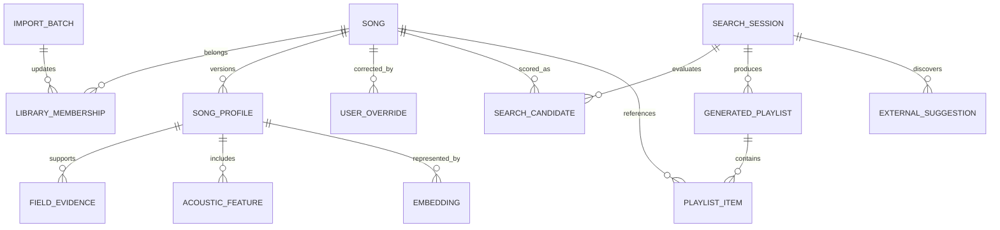

# MoodMusic 数据模型

## 1 建模原则

数据模型必须同时支持当前状态、来源追溯、模型升级、人工覆盖、搜索回放和安全删除。歌曲身份、喜欢成员关系、画像、声学特征和向量分开持久化，避免模型重建意外改变用户的原始音乐库。

所有时间使用 UTC 存储，API 使用 ISO 8601。内部主键使用 UUID；第三方 ID 作为外部引用，不直接作为跨表主键。

## 2 核心实体

### Song

表示一个具体歌曲版本。

| 字段 | 类型 | 说明 |
| --- | --- | --- |
| id | UUID | 内部主键 |
| provider | text | `qqmusic`、`manual` 等来源 |
| source_track_id | text | 平台稳定歌曲 ID；缺失时使用带命名空间的稳定本地哈希 |
| title | text | 规范化歌名 |
| artists | jsonb | 有顺序的歌手身份数组 |
| album | text nullable | 专辑名称 |
| version_label | text nullable | 现场、翻唱、重制等版本 |
| duration_ms | integer nullable | 可靠来源给出的时长 |
| playable_state | enum | `unknown`、`playable`、`unplayable` |
| metadata_source | text | 当前基础元数据来源 |
| created_at | timestamptz | 创建时间 |
| updated_at | timestamptz | 修改时间 |

唯一约束使用 `(provider, source_track_id)`。QQ 音乐没有平台 ID 的历史或下架条目使用标题、歌手、专辑和时长生成不含明文的 `metadata-sha256:` 本地标识；它只用于同一来源内的持久化与去重，不作为跨来源歌曲身份结论，后续仍可进入待确认流程。

### LibraryMembership

表示歌曲是否属于当前喜欢列表。

| 字段 | 类型 | 说明 |
| --- | --- | --- |
| id | UUID | 主键 |
| song_id | UUID | 关联歌曲 |
| library | text | 首期固定为 `liked` |
| active | boolean | 当前是否属于喜欢 |
| first_seen_at | timestamptz | 首次观察时间 |
| last_seen_at | timestamptz | 最近同步时间 |
| removed_at | timestamptz nullable | 取消喜欢时间 |
| import_batch_id | UUID | 最近来源批次 |

### ImportBatch

当前首版迁移记录同步来源、开始结束时间、状态、平台总数、页数、抓取/去重/新增/更新/失效统计和安全错误码。连接器版本、游标与输入哈希在后台任务化时补充；重复同步依靠歌曲与成员关系唯一约束保持幂等。

### SongProfile

每个版本的歌曲多维画像。

| 字段组 | 代表内容 |
| --- | --- |
| identity_summary | 身份与版本摘要 |
| language_vocal | 语种、方言、器乐、男女声、合唱 |
| genre | 主流派、子流派、地域与年代风格 |
| acoustic_summary | 能量、动态、律动、空间感、明暗和密度 |
| emotion | 快乐、悲伤、孤独、温暖、希望、压迫、松弛等连续值 |
| scenes | 夜晚、开车、跑步、通勤、学习、睡前、聚会等带强度场景 |
| lyric_semantics | 主题、叙事视角、情绪走势、意象和显式内容标记 |
| arrangement | 原声或电子、器乐重心、层次和人声位置 |
| exercise_fit | 候选步频、一拍一步或两步、节奏稳定度与依据 |
| semantic_description | 用于检索的自然语言压缩描述 |
| governance | 画像模板、模型、来源、置信度和缺失原因 |

建议将稳定查询字段结构化为列或子表，将低频扩展描述保存在经过 schema 验证的 JSONB 中。每个画像包含：

- `profile_version`
- `schema_version`
- `model_provider`
- `model_id`
- `prompt_version`
- `source_fingerprint`
- `status`
- `created_at`

画像采用追加版本，不原地覆盖。活动版本通过单独引用切换。

### FieldEvidence

为画像字段保存来源、取值、置信度和缺失原因。

- `profile_id`
- `field_path`
- `value_json`
- `source_type`：metadata、lyrics、authorized_audio、model_inference、user
- `source_ref`
- `confidence`
- `missing_reason`

### AcousticFeature

保存 BPM、onset 密度、RMS 能量、动态范围、频谱质心、频谱通量、节拍稳定性和运动适配派生值。必须记录算法版本、采样条件、来源和置信度。无法获得授权音频或可靠第三方数据时保持未知。

### Embedding

- `owner_type` 和 `owner_id`
- `model_provider` 和 `model_id`
- `dimensions`
- `source_hash`
- `vector`
- `created_at`

向量维度在选定实际模型后写入迁移，不在文档阶段硬编码。源文本或模型变化时创建新向量。

当前本地向量适配器选定 `BAAI/bge-m3` 的 1024 维输出，迁移 `20260912_0002` 因此使用 `vector(1024)`。更换维度必须新增数据库迁移，不能只改环境变量。

### UserOverride

保存用户对指定画像字段的人工值、锁定状态、修改时间和可选备注。画像合成时人工锁定优先级最高，重新分析不得覆盖。

### IndexJob

保存任务类型、状态、优先级、输入、输入哈希、总数、已完成、失败数、checkpoint、尝试次数、下次重试、租约和最后错误。状态包括 queued、running、paused、cancelling、cancelled、succeeded 和 failed。

### SearchSession

保存原始描述、追加描述、结构化意图、画像版本策略、模型与算法版本、均衡阈值、边界复核配置、创建时间和会话状态。

### SearchCandidate

记录搜索会话中的歌曲、综合分、分项分、边界判断、是否通过、排除原因、用户删除状态和原始稳定序号。未通过歌曲可以保留用于评测，但普通 UI 不展示。

### GeneratedPlaylist 与 PlaylistItem

GeneratedPlaylist 保存搜索会话、名称、候选快照哈希、排序模式、随机种子、曲线参数、QQ 正式歌单引用和保存状态。PlaylistItem 保存歌曲、顺序、来源类型、人工调整和播放前校验状态。

### ExternalSuggestion

保存搜索任务、原始发现证据、规范化歌名、歌手、版本、校验状态、平台引用、用户动作和过期时间。只有校验通过的项可以在正式结果区展示。

### ConnectorInstallation 与 ConnectorEvent

ConnectorInstallation 保存安装 ID、协议版本、能力、令牌引用、最后在线时间和撤销状态。配对令牌本身不得明文入库。ConnectorEvent 保存去敏后的状态和错误，不保存 Cookie、播放 URL 或页面全文。

## 3 关键关系

## 4 数据保留与删除

- 取消喜欢：保留 Song 和最小成员历史；默认不删除历史队列。
- 删除搜索历史：级联删除会话候选、生成队列和外部建议，不删除歌曲画像。
- 重置画像：删除非人工活动版本和向量；人工覆盖需单独确认。
- 撤销连接器：删除令牌引用并将安装标记为 revoked。
- 完全清除：提供可预览的删除清单，清除本地数据库、凭据引用、缓存与日志，不影响 QQ 音乐账号数据。

## 5 数据质量规则

- 所有枚举值必须由 schema 限制。
- 置信度范围为 0 到 1，未知值不能伪装为 0。
- BPM 必须带来源与算法；模型文本推测不能标记为确定 BPM。
- 同名不同版本不能自动合并。
- 外部建议没有通过身份校验时不得进入可操作结果。
- 画像发布前执行 schema、必需字段结构、来源和人工锁定校验。
